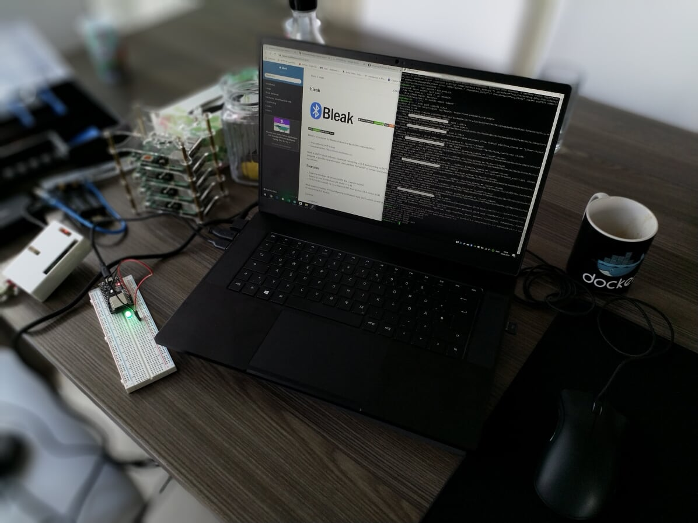

# smart-home-remote

A Smart Home remote that uses battery-powered "satellites" that send control commands to a mains powered "center" via Bluetooth LE, and the powerful "center" server controls your smart home according to these commands
